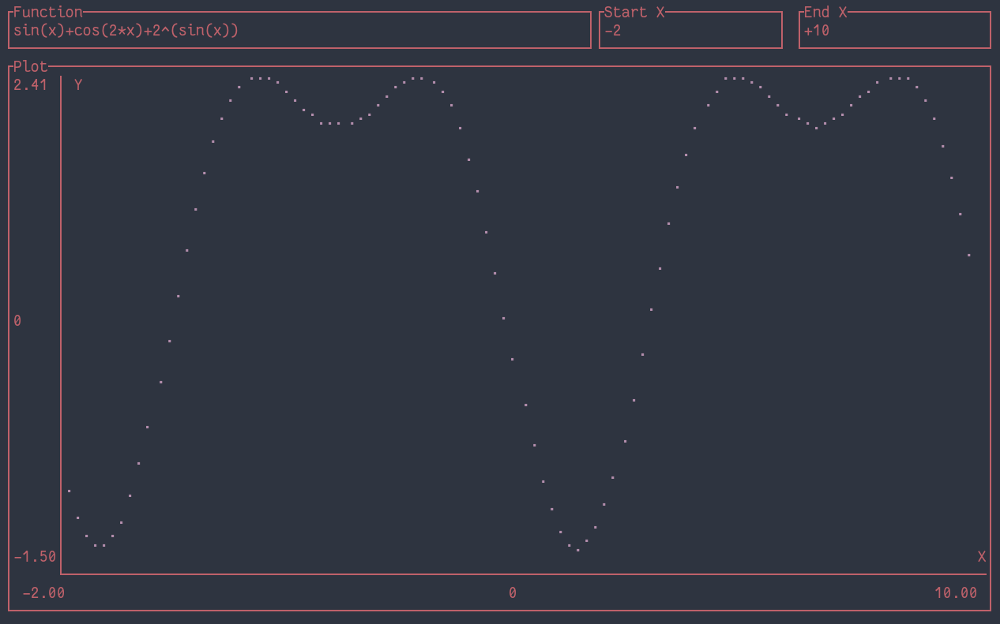

# (s)imple (ex)pression (e)valuator

<center>
    
</center>

There are three components to this project:

- A system to model and evaluate arbitrary arithmetic expressions ([src/expression.rs](src/expression.rs))
- A parser to parse human written expressions into an expression model that can be evaluated ([src/parser.rs](src/parser.rs))
- A graphing interface for the terminal, to graph functions across some domain ([src/interface.rs](src/interface.rs))

Currently, only a limited set of operators are implemented:
* Addition
* Subtraction
* Multiplication
* Division
* Sin
* Cosin
* Tan
* Abs
* Log2
* Negation

More will be coming after other features are stabilized.


## Installation

Rust and Cargo must be installed. I recommend using [rustup](https://rustup.rs/).

```
git clone https://github.com/z2oh/sexe
cd sexe
cargo build --release
```

The binary is then located at `./target/release/sexe`.
